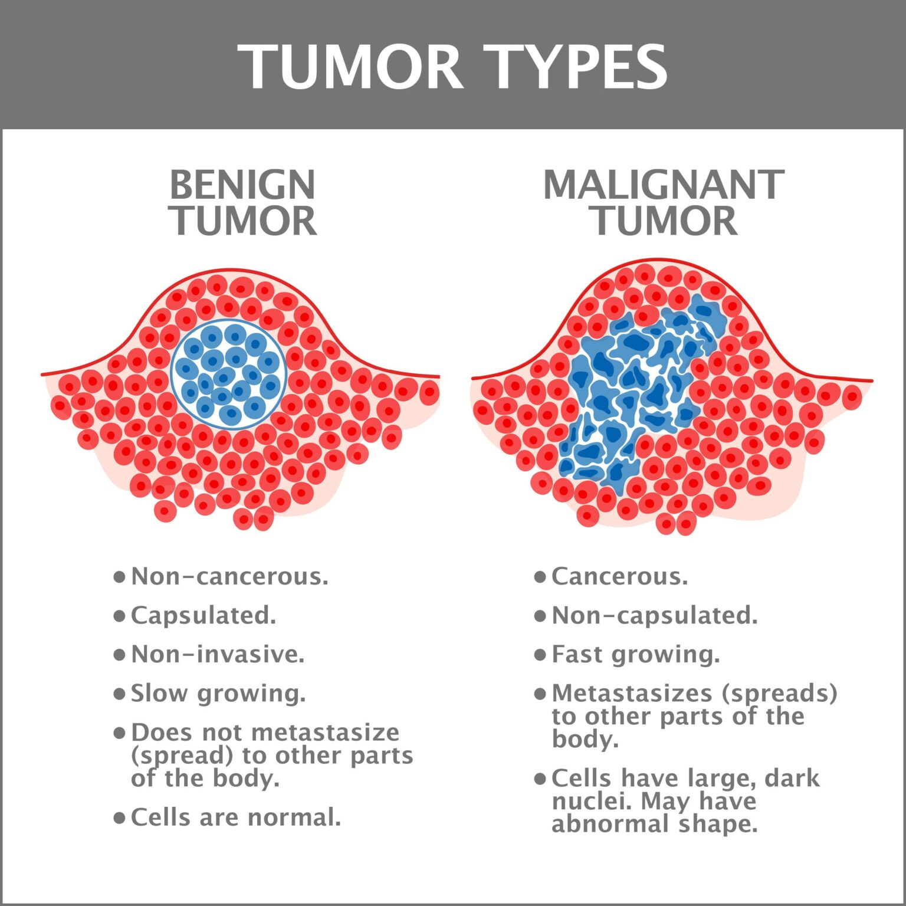

# Breast Cancer Prediction

This project aims to analyze and predict breast cancer diagnoses using machine learning techniques on a publicly available dataset.



## Project Structure

- **Breast_cancer_dataset.csv**  
  The dataset containing features and labels for breast cancer cases.
- **breast_cancer.ipynb**  
  Jupyter notebook with code for data exploration, preprocessing, model training, evaluation, and visualization.
- **README.md**  
  Project documentation.

## Dataset

The dataset includes various features computed from digitized images of breast mass fine needle aspirates (FNAs). Each row represents a patient, with columns for features such as radius, texture, perimeter, area, smoothness, and a label indicating whether the tumor is benign or malignant.

## Workflow

1. **Data Exploration**  
   - Load and inspect the dataset.
   - Visualize feature distributions and relationships.
   - Check for missing values and outliers.

2. **Data Preprocessing**  
   - Handle missing or inconsistent data.
   - Encode categorical variables if necessary.
   - Normalize or standardize features.

3. **Model Building**  
   - Split the data into training and testing sets.
   - Train machine learning models (  Random Forest).
   - Tune hyperparameters for optimal performance.

4. **Evaluation**  
   - Assess models using metrics such as accuracy and classification.
   

5. **Visualization**  
   - plot responsible part for cancer

## Getting Started

### Requirements

- Python 3.x
- pandas
- numpy
- scikit-learn
- matplotlib
- seaborn
- jupyter

Install dependencies with:

```sh
pip install pandas numpy scikit-learn matplotlib seaborn jupyter# breast_cancer

Workspace
(rerun without)
Collecting workspace information

Here’s a more detailed README for your project:

. Running the Project
Open breast_cancer.ipynb in Jupyter Notebook or VS Code.
Run the notebook cells sequentially to reproduce the analysis and results.
. Results
The notebook presents the performance of different models and highlights the most important features for breast cancer prediction. The best-performing model can be used to assist in early diagnosi